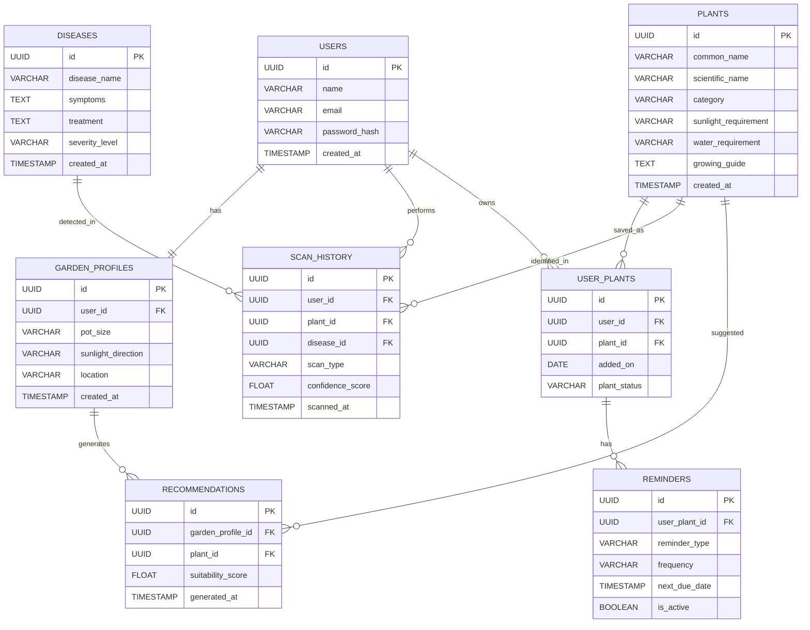

## ER Diagram

```mermaid
erDiagram

    USERS {
        UUID id PK
        VARCHAR name
        VARCHAR email
        VARCHAR password_hash
        TIMESTAMP created_at
    }

    PLANTS {
        UUID id PK
        VARCHAR common_name
        VARCHAR scientific_name
        VARCHAR category
        VARCHAR sunlight_requirement
        VARCHAR water_requirement
        TEXT growing_guide
        TIMESTAMP created_at
    }

    DISEASES {
        UUID id PK
        VARCHAR disease_name
        TEXT symptoms
        TEXT treatment
        VARCHAR severity_level
        TIMESTAMP created_at
    }

    SCAN_HISTORY {
        UUID id PK
        UUID user_id FK
        UUID plant_id FK
        UUID disease_id FK
        VARCHAR scan_type
        FLOAT confidence_score
        TIMESTAMP scanned_at
    }

    GARDEN_PROFILES {
        UUID id PK
        UUID user_id FK
        VARCHAR pot_size
        VARCHAR sunlight_direction
        VARCHAR location
        TIMESTAMP created_at
    }

    RECOMMENDATIONS {
        UUID id PK
        UUID garden_profile_id FK
        UUID plant_id FK
        FLOAT suitability_score
        TIMESTAMP generated_at
    }

    USER_PLANTS {
        UUID id PK
        UUID user_id FK
        UUID plant_id FK
        DATE added_on
        VARCHAR plant_status
    }

    REMINDERS {
        UUID id PK
        UUID user_plant_id FK
        VARCHAR reminder_type
        VARCHAR frequency
        TIMESTAMP next_due_date
        BOOLEAN is_active
    }

    USERS ||--|| GARDEN_PROFILES : has
    USERS ||--o{ SCAN_HISTORY : performs
    USERS ||--o{ USER_PLANTS : owns

    PLANTS ||--o{ USER_PLANTS : saved_as
    PLANTS ||--o{ SCAN_HISTORY : identified_in
    PLANTS ||--o{ RECOMMENDATIONS : suggested

    DISEASES ||--o{ SCAN_HISTORY : detected_in

    GARDEN_PROFILES ||--o{ RECOMMENDATIONS : generates

    USER_PLANTS ||--o{ REMINDERS : has
```
